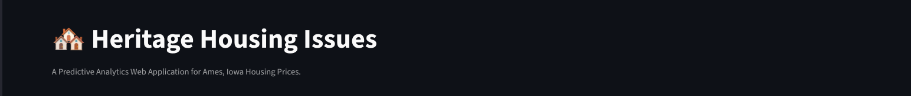
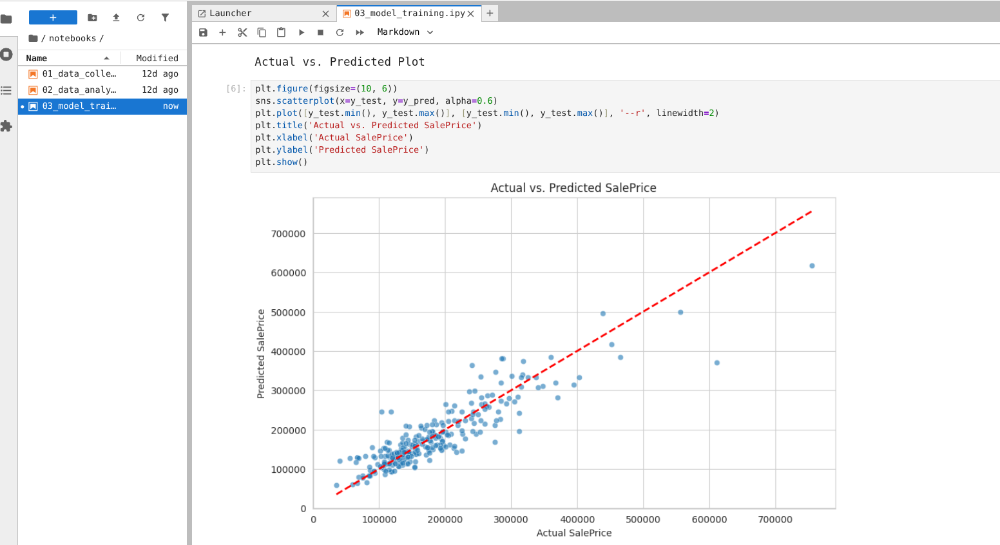
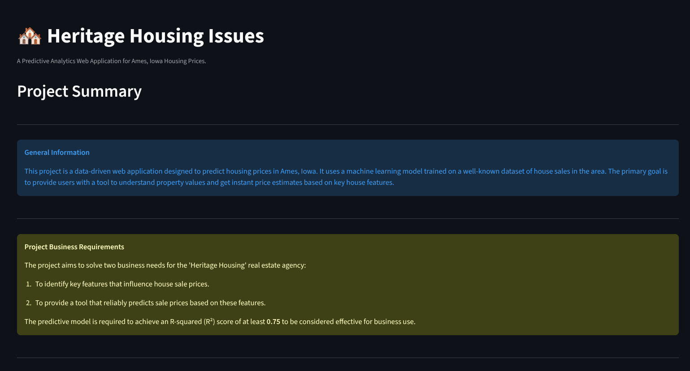
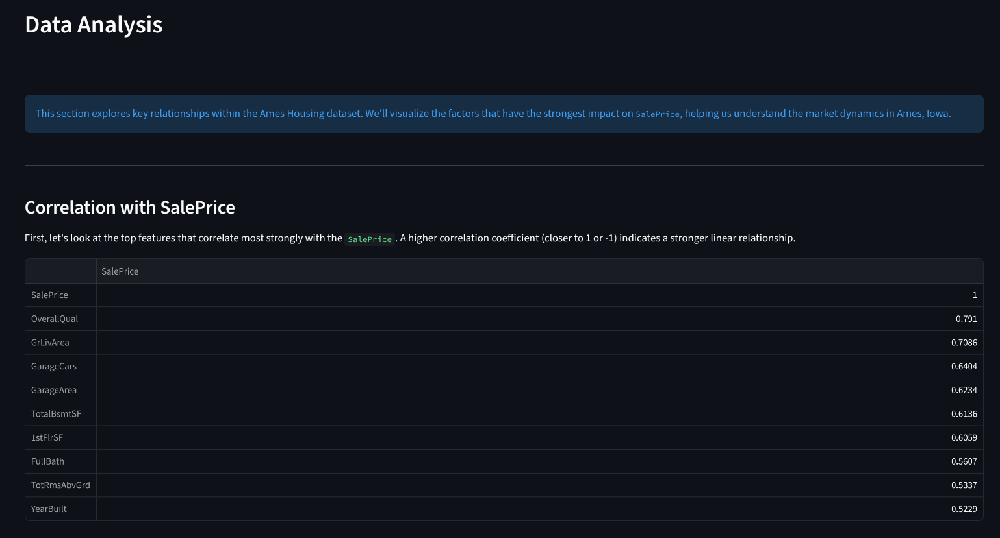
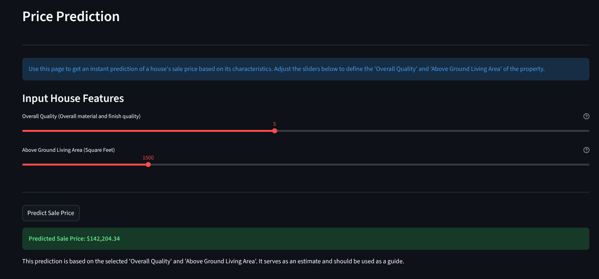

<div align="center">



# **Heritage Housing Price Predictor**

*A Streamlit web application for predicting housing prices in Ames, Iowa, using a machine learning model I trained.*

</div>

<div align="center">

<!-- Badges -->


</div>

---

<div align="center">

**[View Live Demo on Heroku](https://ci-heritage-housing-predictor-7f5331ad4224.herokuapp.com/)**

</div>

---

## 📖 Project Overview

This project is a data science tool I built to bring some data-driven insights to the Ames, Iowa real estate market. The app uses a `RandomForestRegressor` model that I trained to predict house sale prices based on a couple of key property attributes. It's a practical example of a full-stack data science project, covering everything from digging into the data and training a model to deploying it as a live, interactive web app.

I followed a simplified version of the CRISP-DM methodology, focusing on creating a functional and valuable tool that solves a real-world business problem.

## 🎯 Business Requirements

I imagined a fictional real estate agency, 'Heritage Housing', that needed help with two main things:

1.  **Find the biggest value drivers:** They wanted to know which property features have the biggest impact on the final sale price.
2.  **Predict sale prices:** They needed a tool to give them reliable price estimates to help with pricing houses and managing their clients' expectations.

The main goal was to build a model with an **R-squared (R²) score of at least 0.75**. This would mean the model is reliable enough for them to use for business decisions.

---

## Dataset and Preparation

The data for this project is a pre-cleaned version of the famous **Ames Housing Dataset**, which describes the sale of individual residential properties in Ames, Iowa from 2006 to 2010.

- **Source:** I fetched the data directly from [this repository](https://github.com/INRIA/scikit-learn-mooc/tree/main/datasets) provided by the scikit-learn MOOC.
- **Content:** The dataset contains 81 columns describing almost every aspect of a house, from its size and location to the type of roof. The target variable we want to predict is `SalePrice`.
- **Cleaning:** The version of the dataset I used was conveniently pre-processed, with no missing values. This meant I could move straight to data analysis without needing to perform data imputation. The notebooks in the `/notebooks` directory show this process.

---

## 🛠️ Project Workflow & Model

My approach followed a standard data science workflow:

1.  **Data Collection:** Loaded the dataset into a pandas DataFrame.
2.  **Exploratory Data Analysis (EDA):** I dug into the data to find which features were most correlated with `SalePrice`. The analysis showed that `OverallQual` (overall material and finish quality) and `GrLivArea` (above-grade living area square feet) were the strongest predictors.
3.  **Model Training:**
    *   I selected `OverallQual` and `GrLivArea` as my features.
    *   I split the data, with 80% for training the model and 20% for testing it.
    *   I trained a `RandomForestRegressor` model, which is a powerful and reliable choice for this kind of regression task.
4.  **Model Evaluation:** I evaluated the model on the test set to see how well it performed.
5.  **Deployment:** I saved the trained model using `joblib` and built the Streamlit application around it. The final app was deployed to Heroku.

### Model Performance

The business requirement was to achieve an R² score of 0.75 or greater. My model successfully surpassed this goal.

- **R² Score:** **0.81**

The R² score means that our model can explain approximately 81% of the variance in the house sale prices, which is a strong result.

The plot below shows the model's predicted prices against the actual sale prices from the test set. A perfect model would have all dots on the red dashed line. As you can see, our model's predictions are closely aligned with the actual values.



---

## ✨ Application Preview

The application is designed for simplicity and is organized into three pages:

#### 1. Project Summary
The landing page gives an overview of the project, its goals, and the business case.


#### 2. Data Analysis
This page shows key insights from the data analysis, with plots that visualize the relationships between property features and sale prices.


#### 3. Price Prediction
The main feature of the app. Here, users can input values for `OverallQual` and `GrLivArea` to get an instant sale price prediction from the model.


---

## 📂 File Structure

The repository is organized as follows:

```
├───.gitignore
├───app.py                 # Main Streamlit application script
├───Procfile                 # Heroku deployment file
├───README.md                # This file
├───requirements.txt         # Project dependencies
├───setup.sh                 # Heroku setup script
├───.venv/                   # Virtual environment
├───app_pages/               # Contains the individual Streamlit pages
│   ├───page_1_summary.py
│   ├───page_2_data_analysis.py
│   └───page_3_price_prediction.py
├───assets/
│   └───images/              # Screenshots and banner for README
├───notebooks/               # Jupyter notebooks for analysis and modeling
│   ├───01_data_collection.ipynb
│   ├───02_data_analysis.ipynb
│   └───03_model_training.ipynb
└───src/
    └───heritage_housing_model.joblib # The saved, trained model
```

---

## 🚀 Getting Started Locally

To run this application on your local machine, follow these steps:

1.  **Clone the Repository**
    ```bash
    git clone https://github.com/Tarik-Box/Heritage-Housing-Issues.git
    cd Heritage-Housing-Issues
    ```

2.  **Set Up a Virtual Environment**
    ```bash
    python3 -m venv .venv
    source .venv/bin/activate
    ```

3.  **Install Dependencies**
    ```bash
    pip install -r requirements.txt
    ```

4.  **Run the Application**
    ```bash
    streamlit run app.py
    ```
    The application will open in your default web browser.

---

## 🔗 Deployment

This application is deployed on Heroku. To deploy your own version, follow these steps after setting up the project locally:

1.  **Heroku Account & CLI:**
    *   Ensure you have a free Heroku account.
    *   Install the [Heroku CLI](https://devcenter.heroku.com/articles/heroku-cli) on your machine.

2.  **Log in to Heroku:**
    *   Open your terminal and log in to your Heroku account:
        ```bash
        heroku login
        ```

3.  **Create a Heroku Application:**
    *   Create a new app on Heroku. You can do this via the CLI (which also sets up the git remote automatically):
        ```bash
        heroku create your-unique-app-name
        ```
    *   Alternatively, you can create the app from the Heroku dashboard and then add the git remote manually from your app's "Deploy" tab.

4.  **Push to Deploy:**
    *   Once your git remote is set up, push the `main` branch to Heroku to trigger the build and deployment process:
        ```bash
        git push heroku main
        ```

5.  **Open the App:**
    *   After the deployment is complete, you can open the app in your browser:
        ```bash
        heroku open
        ```

**Live URL:** [https://ci-heritage-housing-predictor-7f5331ad4224.herokuapp.com/](https://ci-heritage-housing-predictor-7f5331ad4224.herokuapp.com/)

---

## 🙏 Credits

*   **Code Institute:** For the comprehensive material and structure of the Full Stack Software Development (Predictive Analytics) course this project was based on.
*   **Dataset:** [Ames Housing Dataset](https://www.kaggle.com/c/house-prices-advanced-regression-techniques) from Kaggle.
*   **Assistance:** Gemini-CLI for project guidance, code generation, and documentation enhancement.
*   **Tools:** Jupyter Notebook for data analysis and model development.
